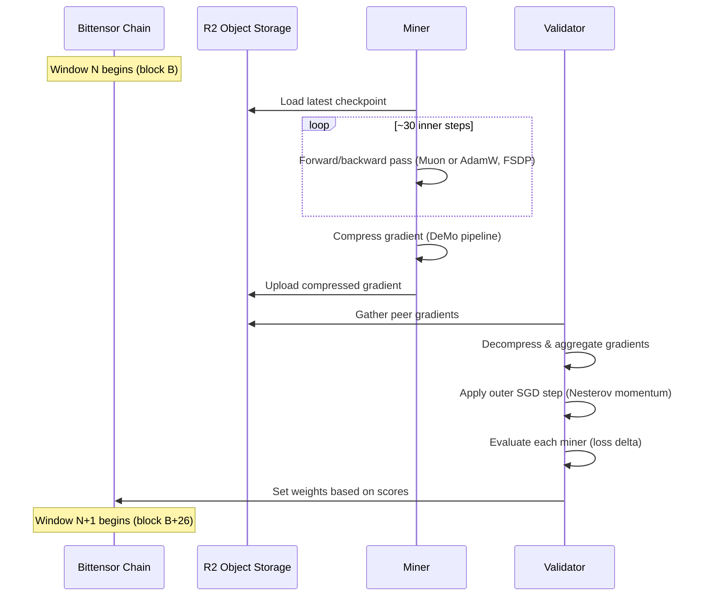

# Hone Architecture

## System Overview

Hone is a decentralized LLM pretraining system built on the [Bittensor](https://bittensor.com/) network. It coordinates distributed training across independent nodes without a central parameter server.

**Miners** contribute gradient updates computed on local hardware. **Validators** evaluate and score those contributions, setting weights on-chain to determine incentive distribution.

Nodes exchange compressed gradients through R2 object storage (S3-compatible). There is no direct peer-to-peer communication for gradient transfer — R2 acts as the shared data plane.

Training is organized into **windows**. Each window spans 26 Bittensor blocks and corresponds to roughly 30 inner optimizer steps. At the end of each window, miners upload their compressed gradient and validators score the contributions.

## Training Flow



### Per-Window Steps

1. **Load checkpoint.** Miners and validators sync to the latest model checkpoint from R2. Checkpoints are saved every `checkpoint_frequency` windows (default: 10).

2. **Inner training loop.** Each miner runs up to `inner_steps` (default: 30) micro-batch forward/backward passes. The inner optimizer is either Muon (default) or AdamW, selected in `hparams.json`. Multi-GPU nodes use FSDP to shard parameters across local GPUs.

3. **Compress gradients.** The accumulated gradient is compressed through the DeMo pipeline: momentum accumulation, optional DCT, top-k sparsification, 12-bit index packing, 8-bit value quantization, and error feedback. See [Compression Pipeline](#compression-pipeline-demo) for details.

4. **Upload to R2.** The sparse compressed representation (indices + quantized values + metadata) is uploaded to the R2 gradient bucket.

5. **Gather peer gradients.** Validators download compressed gradients from up to `gather_peer_count` (default: 20) miners. Gradient norms are clipped to the median to limit the influence of outliers.

6. **Apply outer step.** Aggregated gradients are applied to the model via an outer SGD step with Nesterov momentum (`outer_learning_rate`: 0.4).

7. **Evaluate contributions.** Validators measure each miner's contribution by computing the loss delta: loss before applying the gradient minus loss after. Better gradients produce larger loss reductions.

8. **Set weights on-chain.** Validators translate scores into on-chain weights every `windows_per_weights` windows (default: 3). These weights determine TAO incentive distribution.

## Model Architecture

### Dense: LoopLM

LoopLM is a Llama-style causal decoder-only transformer. Key components:

- **Rotary Position Embeddings (RoPE)** with configurable `rope_theta`
- **Grouped-Query Attention (GQA)** — `n_kv_heads` can be less than `n_heads` for KV cache efficiency
- **SwiGLU MLP** — gated feed-forward with SiLU activation (`gate_proj`, `up_proj`, `down_proj`)
- **RMSNorm** — pre-norm architecture (norm before attention and MLP)
- **Tied embeddings** (configurable via `tie_embeddings`)

### MoE Variant: MoEMLP

The MoE variant uses the same LoopLM backbone but replaces dense MLP layers with `MoEMLP` modules:

- **Top-k gated routing** — a learned linear gate selects the top-k experts per token
- **Normalized routing weights** — top-k softmax probabilities are renormalized to sum to 1
- **Shared expert** — an optional dense MLP that processes all tokens unconditionally (Qwen/DeepSeek style)
- **Load-balancing auxiliary loss** — penalizes uneven expert utilization (`moe_aux_loss_coeff`)

Available MoE configurations:

| Config | Experts | Top-k | Shared Expert | Expert FFN Dim |
|--------|---------|-------|---------------|----------------|
| `1.4B-moe` | 8 | 2 | No | Same as dense |
| `35B-A3B` | 256 | 8 | Yes (dim 512) | 512 |

### Pipeline Parallelism: ResBM

For model-parallel training across nodes connected by limited bandwidth, Hone uses ResBM (Residual Bottleneck Models) to compress activations at pipeline stage boundaries.

- **BottleneckEncoder**: `hidden_dim` -> `bottleneck_dim` via a two-layer network with SiLU
- **BottleneckDecoder**: `bottleneck_dim` -> `hidden_dim` (mirror of encoder)
- **IdentityProjection**: rectangular identity for the residual path across dimension changes
- With `hidden_dim=2048` and `bottleneck_dim=16`, activations are compressed **128x** before crossing the network boundary

## Parallelism Strategy

Hone combines three levels of parallelism:

### Intra-Node: FSDP2

Parameters are sharded across local GPUs using PyTorch FSDP2 (Fully Sharded Data Parallel). Communication happens over NVLink.

- Configured via `fsdp.dp_shard` in `hparams.json` (must match `--nproc_per_node`)
- Supports `torch.compile` (`fsdp.compile: true`)
- Mixed precision with bfloat16 (`fsdp.mixed_precision: "bfloat16"`)

### Inter-Node Data Parallel: DeMo

Gradient exchange between nodes uses the DeMo compressed communication protocol. Gradients are sparsified, quantized, and uploaded to R2. No direct network links between miners are required.

- Compression ratios of 100-1000x depending on `topk_compression` and model size
- Asynchronous — miners upload at their own pace within the window

### Inter-Node Model Parallel: Pipeline Parallelism

For models too large to fit on a single node, pipeline parallelism splits the model across machines. Activations are compressed via ResBM before crossing the network boundary over TCP.

- Configured via `pipeline.enabled`, `pipeline.num_stages`, `pipeline.bottleneck_dim`
- 128x activation compression reduces bandwidth requirements to practical levels

## Compression Pipeline (DeMo)

The DeMo compression pipeline reduces gradient communication by orders of magnitude. It operates per-parameter:

```
Gradient
  |
  v
[1] Accumulate into momentum buffer (decay=0.999)
  |
  v
[2] Chunk tensor & apply DCT (optional, decorrelates & concentrates energy)
  |
  v
[3] Top-k sparsification (keep k largest values per chunk)
  |
  v
[4] Pack indices to 12-bit (25% smaller than int16, max 4096 chunk size)
  |
  v
[5] Quantize values to 8-bit (lookup-table quantization, 6-sigma range)
  |
  v
[6] Subtract communicated values from momentum buffer (error feedback)
  |
  v
[7] Upload sparse {indices, values, metadata} to R2
```

### Step Details

1. **Momentum accumulation.** Each gradient is added to a persistent momentum buffer with exponential decay (`momentum_decay=0.999`). This smooths noise across windows and ensures small but consistent gradients eventually get communicated.

2. **DCT transform.** When `use_dct=true`, the `ChunkingTransformer` reshapes each parameter into 2D chunks of size `target_chunk` (default: 64) and applies a Type-II Discrete Cosine Transform. DCT decorrelates the gradient signal and concentrates energy into fewer coefficients, making top-k selection more effective.

3. **Top-k sparsification.** Only the `topk_compression` (default: 32) largest-magnitude values per chunk are kept. Everything else is zeroed. The surviving values and their indices form a sparse representation.

4. **12-bit index packing.** Indices are packed into 12-bit representation (2 indices per 3 bytes) instead of 16-bit integers. This yields a 25% storage reduction. Requires chunk sizes <= 4096.

5. **8-bit value quantization.** Surviving values are quantized to uint8 using a lookup-table scheme: values are centered, scaled by 6 standard deviations across 256 bins, and the per-bin mean is stored as a lookup table for dequantization.

6. **Error feedback (momentum subtraction).** After selecting the top-k values, the *communicated* values are subtracted from the momentum buffer (scaled by `momentum_subtraction_alpha=0.2`). Information that was not communicated this round remains in the buffer and gets another chance next window.

7. **Upload.** The sparse representation (packed indices, quantized values, quantization parameters, shape metadata) is uploaded to the R2 gradient bucket keyed by UID and window number.
